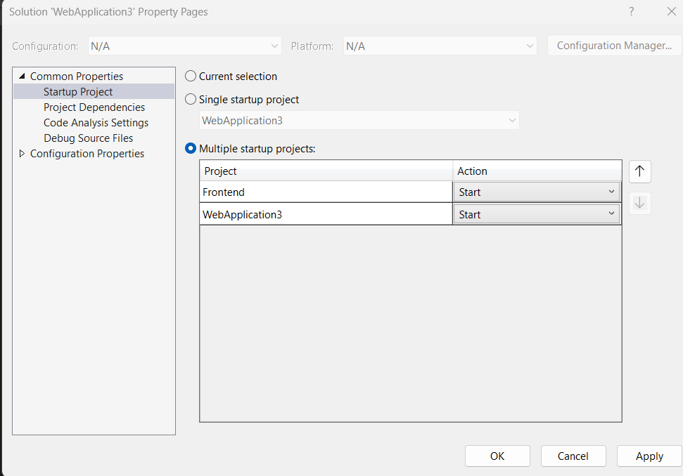

# Week-13 Lab-Manual: REST API Documentation

## Create Web API

1. Create a new ASP.NET Core Web API Project. 
    - Choose .NET Framework 7

2. Install the following NuGet packages
    - EntityFramework
    - EntityFrameworkCore
    - Entityframework tools
    - Mysql.entityframeworkcore

    You can choose the latest version of all the above packages.

3. Download and import the given Employees database file. 

4. Then scaffold it using the Scaffold-DBContext command. 

Windows users can run the scaffold-dbcontext command in package manager console. 

```
Scaffold-DbContext "connection-string" MySql.EntityFrameworkCore -OutputDir folderName -f

```

Mac users can run the command in dotnet-ef

```
dotnet ef dbcontext scaffold "connection-string" MySql.EntityFrameworkCore -o directoryName -f

```

Information on building connection string can be found here:
https://dev.mysql.com/doc/connector-net/en/connector-net-connections-string.html


5. Now right-click on the Controllers folder, then Add > New Scaffolded Item > API > API Controller with Actions, using Entity Framework

    - Then choose the Model class, DBContext class and click Add.

6. Now, run the application and check if you're able to fetch data. If your application URL is https://localhost:7075. To fetch all employees, you can use  https://localhost:7075/api/Employee/{id}

You can check the code generated for which URL to use for each call. 

7. Add the following in Program.cs above the line *builder.build()*

```
builder.Services.AddCors(options =>
{
    options.AddPolicy("CorsPolicy",
        builder => builder.AllowAnyOrigin()
            .AllowAnyMethod()
            .AllowAnyHeader());
});
```
8. Add the below code in Program.cs above the line *app.Run()*
```
app.UseCors("CorsPolicy");
```

Step 7 and 8 helps us in exposing our API globally. If not, the API will be callable only from it's own project.


## Create Front-end

1. Click on your solution name and Add > New Project.
    - Choose ASP.NET Core Web App

2. We've 2 projects in our solution. On click of Run button, both projects must start. So, we need to do a minor configuration change. Right click on the Solution name > Properties > Startup Project > Choose Start for Both projects > Apply.



3. Copy and paste the below code into your index.html
```
@page
@model IndexModel
@{
    ViewData["Title"] = "Home page";
}
<script>
    function getData(){
        let empID = document.querySelector('#empid').value;
        let url = `https://localhost:7066/api/Employees/${empID}`;
        console.log(url)
        fetch(url)
        .then(resp=>resp.json())
        .then(resp=>{
            document.querySelector('#ename').textContent=resp.empName;
                document.querySelector('#ephone').textContent = resp.empPhone;
        });
    }

    function postEmp(){
        let empID = parseInt(document.querySelector('#id').value);
        let empName = document.querySelector('#name').value;
        let phone = document.querySelector('#phone').value;
        let address = document.querySelector('#address').value;
        let salary = document.querySelector('#salary').value;
        let _data = {
            "EmpName": empName,
            "EmpNo": empID,
            "EmpPhone": phone,
            "EmpAdd" : address,
            "salary": salary,
            "DeptNo": "1X",
            "DeptName": "Developer"
        };
        fetch('https://localhost:7066/api/Employees', {
            method: "POST",
            body: JSON.stringify(_data),
            headers: { "Content-type": "application/json" }
        })
            .then(response => console.log(response));
         //   .then(json => console.log(json));
    }
</script>

<div class="text-center">
    <h1 class="display-4">Welcome</h1>
    <p>Learn about <a href="https://docs.microsoft.com/aspnet/core">building Web apps with ASP.NET Core</a>.</p>
</div>

<div>
<h1>Get Employee Data</h1>
<form>
<label for="empid">Employee ID:</label>
<input type="text" id="empid" name="Name" placeholder="Jane Doe">
        <button type="button" id="getemp" onclick="getData()">Get Employee Info</button>
</form>
<h2>Employee Info</h2>
    <table border="1">
        <tr>
            <td> Name</td>
            <td id="ename"></td>
        </tr>
      
        <tr>
            <td>Phone</td>
            <td id="ephone"></td>
        </tr>
    </table>
</div>


<h1>Create Employee</h1>
<form>
<table>
    <tr>
        <td> id</td>
        <td><input type="text" id="id" /></td>
    </tr>

    <tr>
        <td> Name</td>
        <td ><input type="text" id="name"/></td>
    </tr>

    <tr>
        <td>Phone</td>
        <td ><input type="text" id="phone" /></td>
    </tr>

    <tr>
        <td>Address</td>
        <td><input type="text" id="address" /></td>
    </tr>

    <tr>
        <td>Salary</td>
        <td><input type="text" id="salary" /></td>
    </tr>
</table>
<button type="button" id="postemp" onclick="postEmp();">Create</button>
</form>
```

4. Analyze the difference between calling GET and POST methods.
